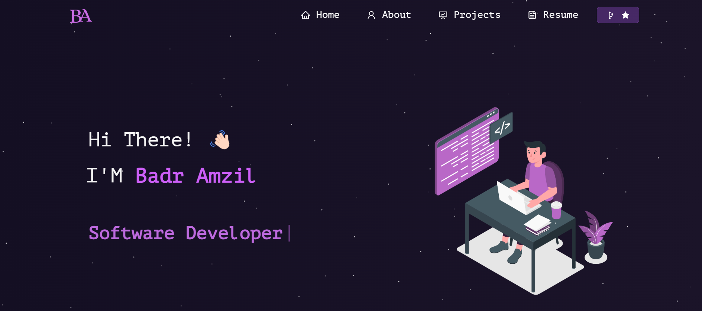

<h2 align="center">
  Portfolio Website - v2.0<br/>
  <a href="https://portfoliobadramzil.vercel.app/" target="_blank">
    portfoliobadramzil.vercel.app
  </a>
</h2>

<div align="center">
  
</div>

<br/>

<center>

[](https://forthebadge.com) &nbsp;
[](https://forthebadge.com) &nbsp;
[](https://forthebadge.com) &nbsp;
 &nbsp;


</center>

<h3 align="center">
    🔹
    <a href="https://github.com/badramzil01/Portfolio/issues">Report Bug</a>
    &nbsp;&nbsp;
    🔹
    <a href="https://github.com/badramzil01/Portfolio/issues">Request Feature</a>
</h3>

---

## About

This is the personal portfolio website of **Badr Amzil**,  
built with **React.js** and deployed on **Vercel**.

🔗 Live Demo:  
👉 https://portfoliobadramzil.vercel.app/

---

## Built With

My personal portfolio website showcases my projects, resume,
technical skills, and professional experience.

This project was built using the following technologies:

- React.js
- Node.js
- Express.js
- CSS3
- VS Code
- Vercel

---

## Features

📖 **Multi-Page Layout**  
🎨 **Styled with React-Bootstrap and CSS (easy to customize)**  
📱 **Fully Responsive (Mobile / Tablet / Desktop)**  

---

## Getting Started

Clone this repository.  
Make sure you have `node.js` and `git` installed globally.

```bash
git clone https://github.com/badramzil01/Portfolio.git
cd Portfolio
